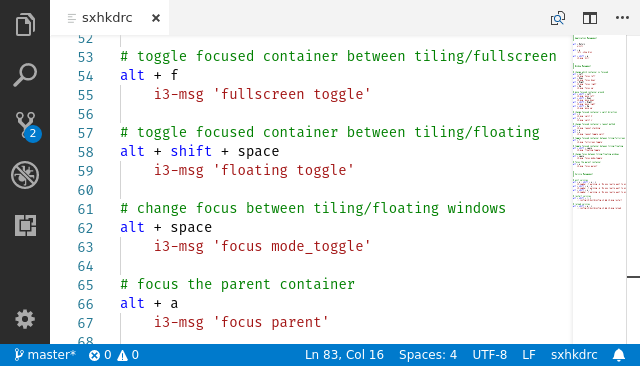
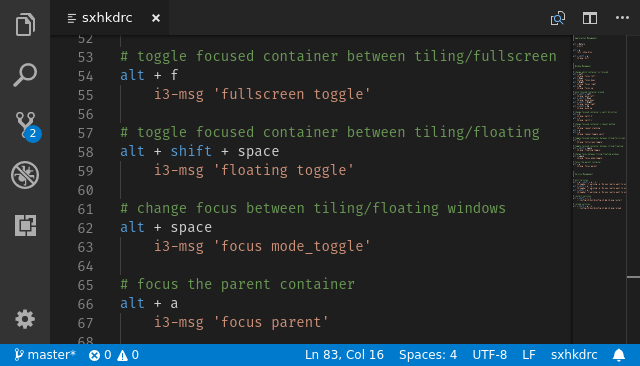
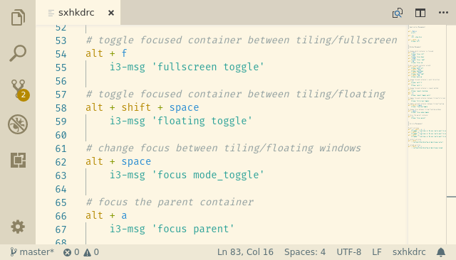
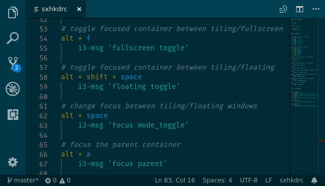
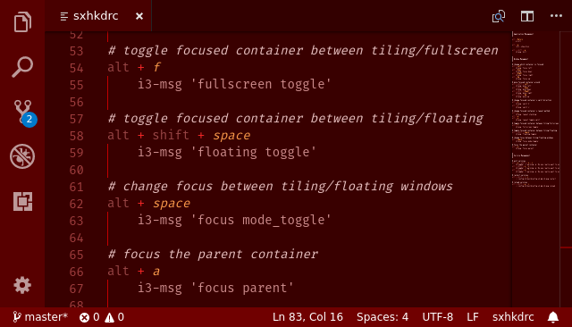
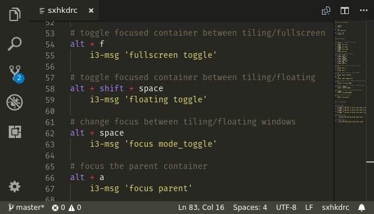

# sxhkdrc Syntax

Syntax definition for the sxhkd configuration file for Visual Studio Code.

The tokenizing rules are based on the [sxhkd documentation](https://github.com/baskerville/sxhkd/blob/master/doc/sxhkd.1.asciidoc#configuration).

I didn't find any pre-existing sxhkd highlighters to work from, so I worked this up from scratch. (And it's my first TextMate grammar.)

In other words - GitHub issues/pull-requests are _welcome_ if you find errors or would like to improve this extension.

## Screenshots

Examples from some of the color themes that VS Code includes by default:

